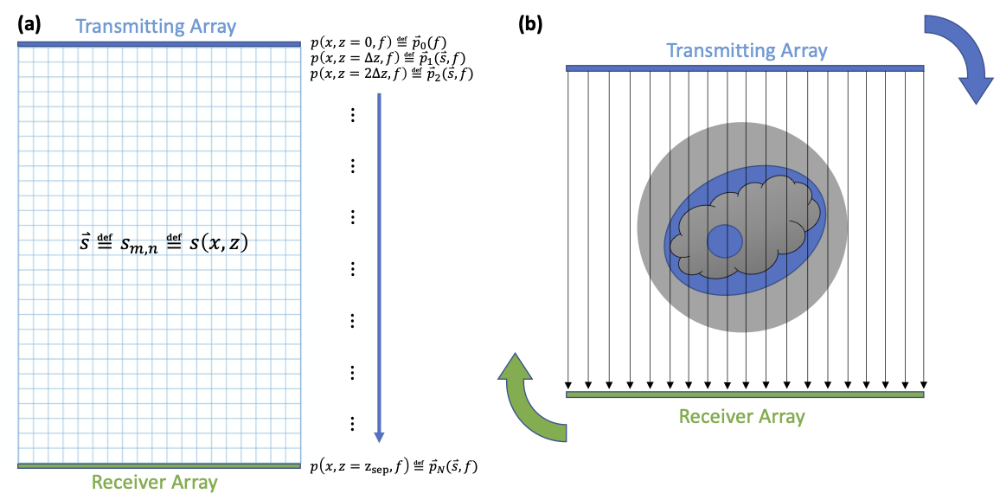
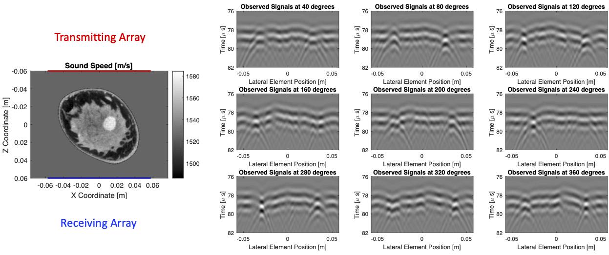
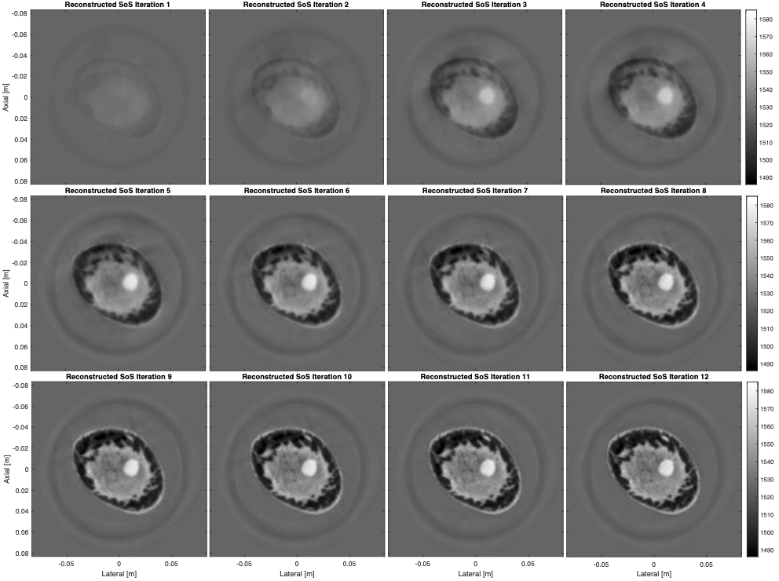

# FullWaveformInversionUSCT
Full Waveform Inversion (FWI) for Transmission Ultrasound Computed Tomography with Transmitting and Receiving Linear Array Transducers based on the Angular Spectrum Method

# Code and Sample Datasets
**Please download the sample data (sim_breast.mat) under the [releases](https://github.com/rehmanali1994/FullWaveformInversionUSCT/releases) tab for this repository, and place that data in the [MATLAB](MATLAB) or [Python](Python) directories.**

From either the [MATLAB](MATLAB) or [Python](Python) directories, please run [BreastTomography.m](MATLAB/BreastTomography.m) or [BreastTomography.py](Python/BreastTomography.py) in order to run the FWI reconstruction of the simulated breast phantom

# Citing this Work
If you use the code/algorithm for research, please cite the SPIE conference proceedings paper: 

> Ali, R., Dahl, J. "Open-Source Full-Waveform Ultrasound Computed Tomography Based on the Angular Spectrum Method Using Linear Arrays". *Manuscript in preparation for SPIE Medical Imaging conference.*

You can reference a static version of this code by its DOI number: 

# Schematic of the Imaging System
The schematic below shows the coordinate system (a) used to perform the angular spectrum method. This grid is rotated as the two linear arrays are (b) rotated around the medium to collect receive signals sampled from all angles by rotating a full a 360 degrees (in 2 degree steps) around the object of interest:

# Simulated Dataset
Simulated receive signals (from k-Wave) are shown for 9 different views around the medium:

# Results
When FWI is used to reconstruct the speed of sound in the medium using the angular spectrum method, here are the results after 12 iterations:

